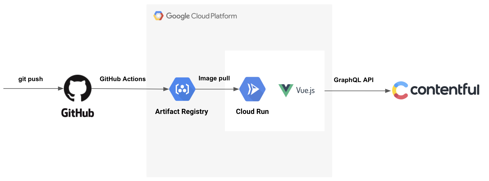

# anan-blog
for anan blog web site

# Usage
`.env` ファイルをプロジェクトルートに配置する。

```
VUE_APP_CONTENTFUL_SPACE_ID=<space id>
VUE_APP_CONTENTFUL_ACCESS_TOKEN=<token>
```

# Overview



# Architecture

## Frontend

- Vue.js

## Backend

- Contentful with GraphQL

## Infra

- Google Cloud Run